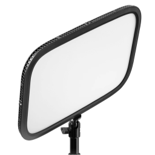
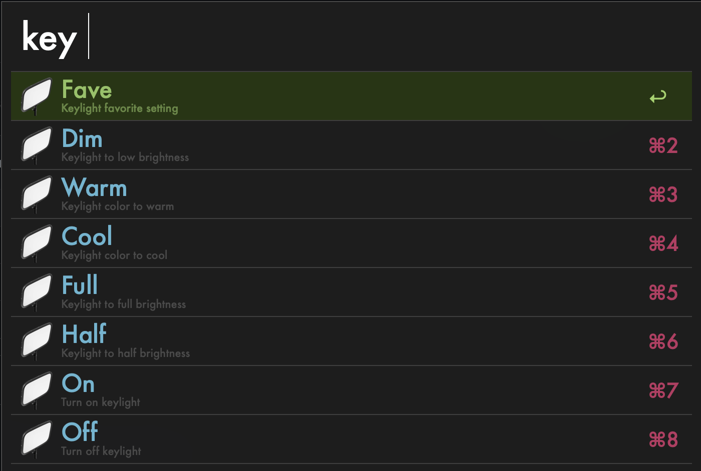
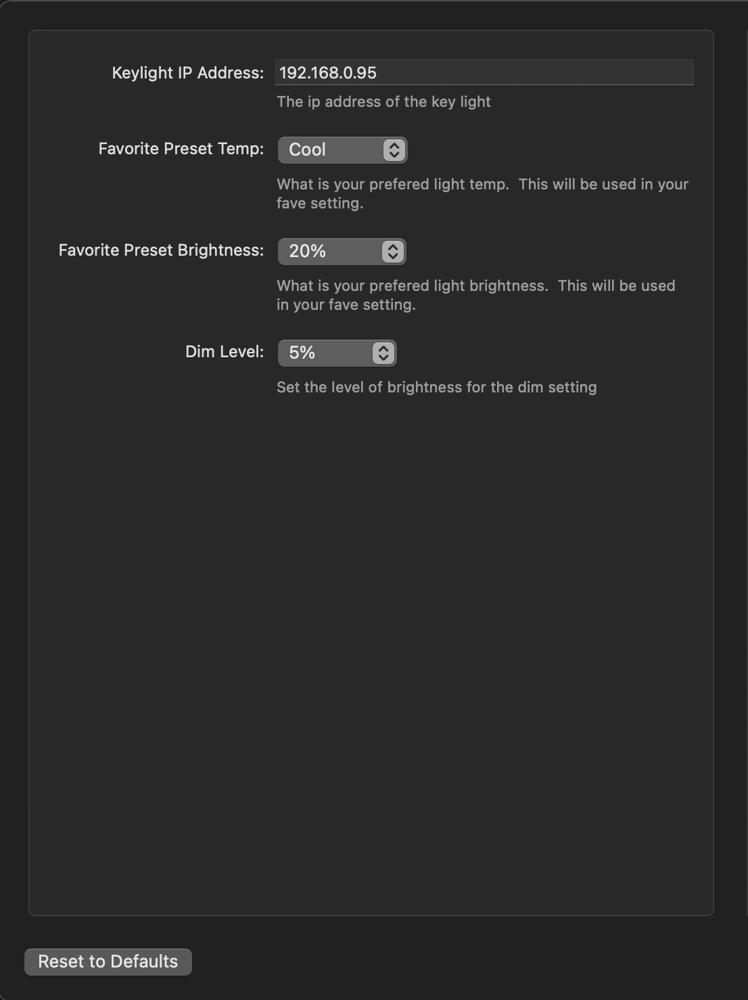

#  Elgato Keylight Alfred Workflow

Control your elgato keylight from Alfred

<a href='#'>⤓ Download Here</a>

## Usage

Update the status of your key light by using the keylight control keyword (default: `key`) and then press space to see a list of options.

## Configuration

Many settings are available through the built-in workflow configuration tool. You must configure the IP address of your key light for this workflow to work.

## Thanks

Big Thanks to [adamesch](https://github.com/adamesch/elgato-key-light-api) for detailing the elgato api.
